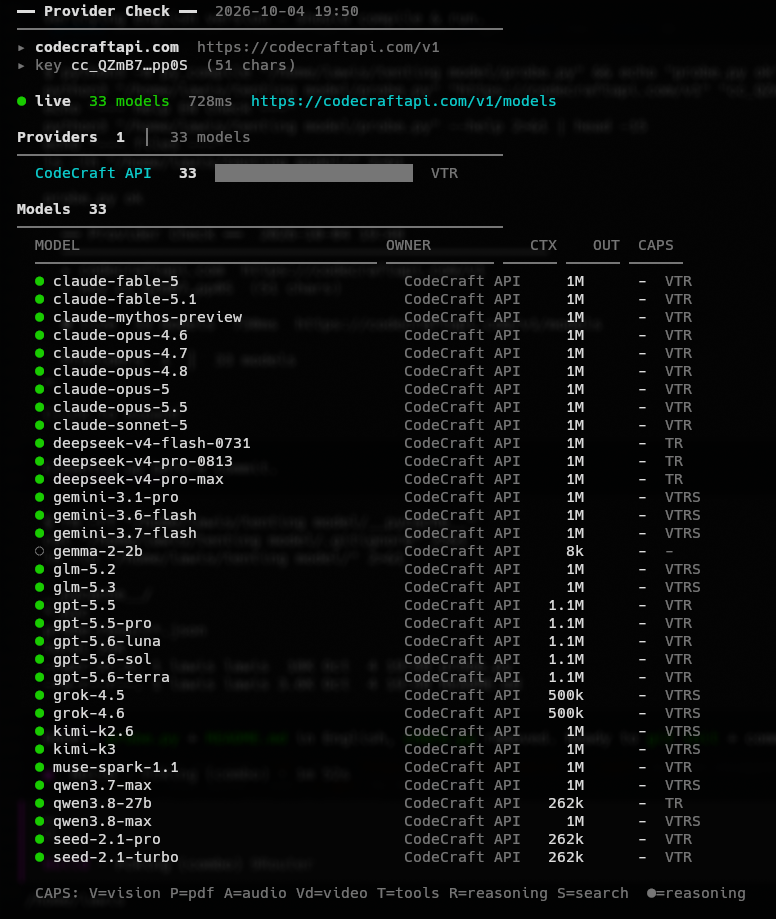
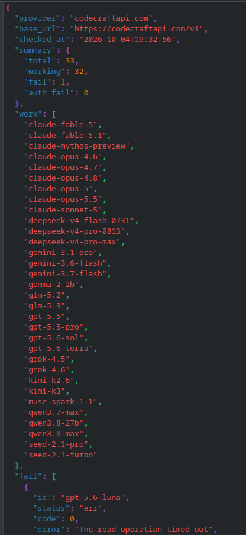

# Provider Probe

Check any OpenAI-compatible provider — just **Base URL + API Key**. List models, test connectivity, and get a clean summary. Stdlib only, no install needed.

## Preview



### Features

- Paste **Base URL** & **API Key** separately (interactive)
- List all models + provider, context window, capabilities
- `--test` (1 model/provider) & `--test-all` (all models)
- **Summary** at the end: ✔ Working / ✘ Failed + latency
- Ask to **save JSON** after `--test-all` (or `--save` auto)
- Filter `-s` / `-p`, sort `--sort ctx`, `--limit`, `--json`

### Requirements

Python 3.8+ — no additional dependencies.

### Usage

```bash
python3 probe.py
# ➜ Base URL: https://codecraftapi.com/v1
# ➜ API Key : cc_xxx

python3 probe.py https://codecraftapi.com/v1 cc_xxx
python3 probe.py -u https://api.openai.com/v1 -k sk-xxx --test
```

### Options

| Flag | Description |
|------|-------------|
| `base_url` `api_key` | Positional — `probe.py <url> <key>` |
| `-u`, `--base-url` | Base URL (e.g. `https://api.openai.com/v1`) |
| `-k`, `--api-key` | API key |
| `--test` | Live-test 1 model per provider (saves quota) |
| `--test-all` | Live-test all models + summary + ask to save JSON |
| `--save [FILE]` | Save JSON immediately without asking (`--save` = auto name, `--save result.json` = custom) |
| `-s`, `--search` | Filter model id (substring) |
| `-p`, `--provider` | Filter by owner/provider |
| `--sort` | `provider` (default), `ctx`, `name` |
| `--limit N` | Limit displayed models |
| `--timeout` | Timeout in seconds (default 10) |
| `--workers` | Parallel test workers (default 6) |
| `--json` | Output raw JSON |
| `--no-color` | Disable colors |

### Examples

```bash
# List models
python3 probe.py https://codecraftapi.com/v1 cc_xxx

# Check + live test
python3 probe.py https://codecraftapi.com/v1 cc_xxx --test

# Test all + summary + ask to save JSON
python3 probe.py https://codecraftapi.com/v1 cc_xxx --test-all

# Save JSON directly without prompt
python3 probe.py https://codecraftapi.com/v1 cc_xxx --test-all --save
python3 probe.py https://codecraftapi.com/v1 cc_xxx --test-all --save result.json

# Filter & sort
python3 probe.py https://codecraftapi.com/v1 cc_xxx -s gpt --sort ctx --limit 10
python3 probe.py http://localhost:11434/v1 ollama -s llama --test

# Raw JSON output (model list)
python3 probe.py https://codecraftapi.com/v1 cc_xxx --json > models.json
```

### `--test-all` Output

```
  ── Summary ──  5 total
  ✔ 4 working  ✘ 1 failed    9189ms avg

  ✔ Working (4)
    • gpt-5.5-pro                          3873ms
    ...

  ✘ Failed (1)
    • gpt-5.5                              15027ms  0 The read operation timed out

  ➜ Save test results to JSON? [y/N]: y
  ➜ File name [enter = auto]:
  ✔ saved  probe-result-codecraftapi.com-20261004-193102.json  1314 bytes
```

### JSON Format

```json
{
  "provider": "codecraftapi.com",
  "base_url": "https://codecraftapi.com/v1",
  "checked_at": "2026-10-04T19:31:02",
  "summary": { "total": 5, "working": 4, "failed": 1, "auth_failed": 0 },
  "working": ["gpt-5.5-pro", "grok-4.5"],
  "failed": [{ "id": "gpt-5.5", "status": "err", "code": 0, "error": "...", "latency_ms": 15027 }],
  "results": [{ "id": "gpt-5.5-pro", "provider": "CodeCraft API", "status": "ok", "code": 200, "latency_ms": 3873, "error": "" }]
}
```
## Preview



### Tips

- Base URL should end with `/v1` (e.g. `https://api.openai.com/v1`). `?ref=` is auto-stripped.
- `--test-all` uses quota — use `-s gpt` to test a subset.
- Cloudflare 403 (error 1010) = UA blocked — already handled.

### License

MIT
